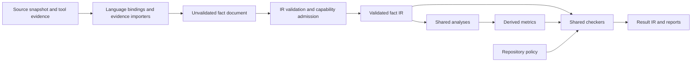

## Context

The operator requests an IR that makes code quality analysis independent of the
source language: implementations for Rust, Go and later languages return facts;
checkers operate on that common representation. The implementation remains Rust.
This design replaces the earlier brief's emphasis on normalized tool metrics with
an explicit fact layer from which shared analyses derive metrics and findings.

Evidence: `vision:language-neutral-code-quality` records the operator request;
`README.md:3` states the pipeline. Prior art was inspected at
https://github.com/fluxplane/codegate/tree/4d1515ea925a0d4018ca59da2de3c31a91187f4e.
Its `engine.go:13` combines assessment with editing/navigation. Its
`internal/core/types.go:74` describes metrics by ID/category/description, and
`:389` carries metric values in an untyped map. Its
`internal/lang/goast/quality.go:12` fixes thresholds in the Go backend and
`internal/lang/goast/assess.go:322` computes language-local quality scores.
Those are useful references, not dependencies or source to transplant.

All contracts below are proposed semantics, not existing ESS syntax or implemented
APIs. This draft is intended for review before domain formalization and delivery.

## System Context

Codegate consumes a selected source snapshot and optional tool-produced evidence.
It produces validated facts, derived metrics, findings and explicit check outcomes.
It serves developers, agents and repository CI with the same deterministic evaluator.

ESS owns specification compilation and conformance mechanisms. AEP owns the plan.
Gates retains common security/privacy enforcement, evidence signing and bot delivery.
Codegate neither replaces those systems nor needs them running to evaluate a fact file.

## Goals

- Add a language by implementing a binding for existing fact families, without
  changing the shared evaluator or existing checkers.
- State what facts mean independently of the tool or language that supplied them.
- Distinguish observed absence from missing, partial or unsupported analysis.
- Make evaluation reproducible and every result traceable to facts and evidence.
- Support several languages in one source snapshot without inventing cross-language
  relations that no producer observed.
- Begin with a small useful Rust vertical slice and prove portability with a second
  language before stabilizing the contract.

## Non-Goals

A universal AST, a compiler middle end, complete program equivalence, automatic
refactoring, a code editor, distributed collection, a service/database, dynamic
plugin loading, arbitrary embedded policy scripts and a universal quality grade.
The binding boundary does not promise that every language supplies every fact.

## Current State

The repository contains only this initial design, its vision, repository guidance
and AEP configuration pinned to AEP 0.68.0's exact published protocol commit.
The initial reverse scan found no source, tests, CI, task targets or contracts.
There is no legacy backlog to migrate and no implementation to retrofit.

## Target vs Current State

The target is a Rust library and clap-derived CLI with language-independent core
analysis. Current delivery is two draft AEP artifacts. No ESS model, generated
contract, runtime, binding, executable check or passing conformance suite exists yet.

## Proposed Design

### 1. Bindings produce facts

A binding translates language/tool semantics into versioned, typed fact families.
It performs parsing, name resolution and tool-specific interpretation as necessary.
It does not choose organization thresholds, suppress policy violations, compute
quality grades or implement the common graph algorithms.

A Rust binding may wrap Cargo/compiler output and parse source; a Go binding may
wrap Go tooling. Committed Codegate implementations are Rust in both cases.
External language toolchains are runtime dependencies of their selected bindings.

A fact may require language-specific computation to extract it. For example, a
binding resolves a dependency's destination and distinguishes build-only from
runtime dependencies; the common checker decides whether that edge is permitted.
Source-language names are provenance/display data, never a switch in a shared rule.

### 2. Small, typed fact families

The initial core is a quality-analysis graph, not a serialization of arbitrary ASTs.
Only facts required by a named common analysis enter the stable contract.

| Family | Facts and meaning | Shared uses |
| --- | --- | --- |
| Inventory | Snapshot-local units, source files, declarations and containment; explicit unit/declaration kinds; source or generated origin | Scope selection, inventories, per-unit counts |
| Dependencies | Directed edges between resolved units; edge kind (runtime, build, test); declared/resolved/observed basis; unresolved targets retained explicitly | Boundary violations, fan-in/out, dependency cycles |
| Declarations | Callable/type/value/namespace identity; externally reachable versus restricted versus unknown visibility; documentation presence | Public API counts and documentation ratios |
| Source extent | File content identity, source spans and exact line classifications under a named counting convention | Function/file size and source/test/generated counts |
| Execution evidence | Individual test outcomes and measured covered/coverable items tied to the snapshot/configuration | Test outcomes, execution coverage and regression checks |
| Tool diagnostics | Producer rule identity, severity, locations, evidence and tool result status | Explicit diagnostic policies; not proof of a portable semantic rule |

A producer-local extension must use a declared versioned schema. Unrecognized
extensions remain opaque and cannot satisfy a common checker's fact requirements.
No untyped property bag becomes the semantic interface.

Calls, implementations and control-flow graphs are later typed families, introduced
with an actual checker and language mappings. Unresolved dynamic dispatch remains
unresolved; syntax-only guesses cannot masquerade as a complete call graph.
Complexity is deferred until a common control-flow/decision convention is specified
and validated across Rust and Go. No binding supplies a magic complexity score under
an underspecified common name.

### 3. Shared analyses derive measurements

Analyses take only validated IR and explicit analysis configuration. Examples:
unique outgoing runtime dependencies per unit, forbidden dependency edges,
strongly connected components, documented eligible declarations divided by all
eligible declarations, and covered items divided by coverable items.

Each metric definition names a version, value type, unit, required fact profile,
subject scope, counting method, aggregation and empty-domain behavior. Different
semantic methods require different identities or an explicit compatibility mapping.
A dependency count counts distinct destination units, not source import statements.
A documentation ratio measures documentation presence, not documentation quality.
A build-dependency cycle is not automatically a runtime architecture cycle.

Counts use integers; ratios preserve numerator and denominator. Aggregation sums
compatible disjoint populations, never averages percentages. Duplicate evidence is
rejected or deduplicated by defined identity, never counted twice. Empty populations
produce not-applicable only where the metric definition permits that result;
otherwise they produce an explicit unavailable result. Threshold comparisons use
exact rational arithmetic, with overflow refusal, before presentation rounding.

### 4. Shared checkers judge facts and measurements

A checker declares its ID/version, required fact and analysis versions, scope,
coverage requirement and typed configuration. It can inspect graph facts directly
or consume shared derived metrics. It cannot invoke a binding or read source files.

Initial policy primitives: comparison, required result, allowed/forbidden dependency
edges, acyclicity, and a compatible-baseline regression constraint. A named profile
selects these primitives and parameters; there is no general scripting language.
Repository rules bind architectural roles to units explicitly. Codegate does not
infer that a directory named `domain` forbids host IO in every project.

Tool-specific diagnostics retain their namespace. A check for a particular Clippy
rule is explicitly a tool-specific policy evaluated by a common diagnostic checker;
it is not presented as a portable semantic check with Go-equivalent meaning.

### 5. Capability and coverage are separate

A binding descriptor states supported IR versions, fact families and methods.
Each collection then records actual coverage per family, subject scope and build
configuration: complete, partial, unsupported or failed, with gaps and reasons.
Completeness describes a defined observation universe. A complete inventory of
selected files does not imply complete macro expansion or complete call resolution.

A resolved dependency graph can be complete for one feature/target selection while
omitting inactive code by definition. The policy selects the configurations it
requires; a binding may not silently narrow that selection. Partial facts may prove
a witnessed forbidden edge, but cannot prove absence of forbidden edges or a
complete metric. Such a finding remains a failure with incomplete coverage retained.

Portable support means a new language can supply existing facts and reuse existing
checks. Novel semantics outside the contract require a versioned fact extension and
possibly a new common checker. They never authorize a hidden language branch.

## Boundaries

The collection edge owns filesystem/process/network effects, tool selection, parsing,
resource limits and raw evidence. IR validation owns references and semantic
well-formedness. Analyses own derivation. Checkers own judgments. Reports own display.
The IR/checker core has no dependency on language bindings or compiler SDKs.

Fact import and offline evaluation never run tools. Explicit collection may execute
build scripts, compiler plugins or tests through selected toolchains, so its execution
mode and environment belong to the host/CI boundary. It is not safe inert scanning.

## Ownership

Proposed initial package: one Rust crate with library and clap-derived binary,
organized into model, validate, analysis, check, binding and report modules. Split
crates only when a demonstrated dependency boundary benefits from compiler enforcement.
Architecture checks must enforce forbidden core-to-binding imports even in one crate.

Core maintainers own fact/metric semantics and checker contracts. Binding maintainers
own language mappings, extraction and evidence coverage. Adopters own architectural
roles, required checks, thresholds and reviewed exceptions. No producer controls
policy on the strength of being able to provide observations.

## Cross-System Invariants

1. Equivalent semantic facts and configuration yield equivalent metric values and
   checker outcomes regardless of producer language; provenance/locations may differ.
2. Every graph reference resolves within the admitted snapshot or is explicitly
   unresolved. Unknown identity never silently drops an edge.
3. A result cites the fact snapshot, checker/analysis versions and policy digest.
4. Required missing, failed or insufficient facts cannot result in pass.
5. Source/configuration changes invalidate imported evidence unless its producer
   can establish an explicit compatible identity. Same commit alone is insufficient.
6. No common checker reads language syntax, calls external tools or branches on language.
7. Measured zero is distinguishable from no measurement; excluded entities and
   exceptions remain visible in evidence and accounting.
8. Shared interpretation is versioned. Changing what a dependency or coverage unit
   means is a contract change even if JSON field names stay the same.

## Interfaces

Proposed command shapes, not commands implemented today:

- `codegate collect --root <path> --binding rust --out facts.json`
- `codegate evaluate --facts facts.json --policy policy.json --out report.json`
- `codegate check --root <path> --policy policy.json` combines those explicit stages.
- `codegate capabilities --binding rust` prints supported families and methods.

A statically registered Rust binding interface initially returns an unvalidated fact
document. No dynamic ABI, marketplace, daemon or plugin RPC protocol is required.
Language-specific compiler output is internal to the binding. Tool evidence importers
use the same admission contract and may add supported families to a snapshot.

Fact JSON and result JSON are independently versioned contracts. Admission checks
supported versions, unique IDs, containment cycles, edge endpoint kinds, spans,
required coverage records, numeric constraints and evidence consistency before
constructing an immutable validated in-memory IR. Unknown required versions refuse.
Optional extensions are explicit; unknown fields in core records are not silently
accepted as if understood. Set-like collections canonicalize in stable ID order;
semantically ordered collections retain order. Duplicate/conflicting IDs refuse.

The evaluator is a total, pure operation over validated inputs with stable diagnostics.
Unsupported policy primitives and invalid configuration are errors, not warnings.

## Data Model

The ESS domain will give these proposed concepts typed homes before any epic/story:

| Concept | Proposed responsibility and identity |
| --- | --- |
| FactSnapshot | Content-addressed semantic snapshot; source manifest digest, selected configuration, declared IR version |
| Subject | Snapshot-scoped ID; unit/file/declaration kind, containment and origin |
| Fact | Typed relation or observation with subject references and provenance |
| Evidence | Producer/version/method, input artifact digest and source/tool locations |
| Coverage | Family + scope + configuration, status, declared universe and explicit gaps |
| MetricDefinition | Versioned semantic ID, type/unit, derivation and aggregation contract |
| Measurement | Metric version + subject + configuration, value or unavailable reason, contributing facts |
| Policy | Versioned rules, selected scopes, required configurations and bounded exceptions |
| Evaluation | Exact snapshot and policy identities, analysis/checker versions, results |
| Finding | Rule, subjects/locations, explanation and fact/evidence references |

Containment and reference cardinalities will be formal ESS relations, not fields that
only resemble foreign keys. These are proposed concepts, not a claim that every row
must become a persisted entity or lifecycle. Immutable records should remain simple.

Source identity includes dirty/untracked selected inputs and relevant configuration,
not merely Git HEAD. A snapshot-local ID is deterministic for its selected source
and binding method; it is not a promise of stable identity across renames. Baseline
comparison needs an explicit subject correspondence or returns not-comparable.

Adding another producer requires matching source/configuration identity. Each family
and scope has a selected authoritative producer; conflicting overlapping observations
refuse rather than using last-writer-wins. Cross-language relations need explicit
interop evidence. Unioning Rust and Go inventories does not resolve FFI calls.

Timestamps, host paths and collection durations live in a provenance envelope outside
the canonical semantic digest. Tool/method versions and evidence digests remain bound
to assessment identity. Semantic-equivalence testing compares normalized outcomes;
byte-for-byte reproducibility applies to the same exact admitted inputs.

## Failure Modes

| Condition | Required behavior |
| --- | --- |
| Malformed IR, dangling reference, contradictory counts, conflicting producers | Refuse admission with stable coordinates |
| Binding cannot supply a required family | Unsupported result; required gate cannot pass |
| Tool crash, timeout or evidence parse failure | Error, retaining bounded diagnostics |
| Required family only partially observed | Incomplete outcome; witnessed violations may still fail |
| No eligible subjects | Explicit definition-controlled not-applicable or unavailable result |
| Stale/mismatched evidence | Refuse attachment; never use it as current facts |
| Incompatible baseline/method or unmapped subject | Not-comparable, never a zero delta |
| New unknown mandatory IR semantics | Version/capability refusal |

Per-check outcomes are pass, fail, incomplete, unsupported, error or not-applicable.
Not-applicable needs an explicit eligibility explanation. Overall success requires
all required checks to pass or to be explicitly permitted as not-applicable; waived
findings remain visible with the exception's scope, reason, owner and expiry.
The proposed CLI exits 0 for success, 1 for observed policy failure, and 2 when a
required evaluation cannot complete; mixed failures retain all outcomes in the report
and use exit 2. Optional failures do not conceal required-check status.

## Security

Imported facts and source are untrusted data. Use bounded sizes, schema validation,
path confinement for evidence reads and no implicit source/tool execution. Reports
avoid absolute personal paths and raw environment/secret content. Provenance explains
origin but does not prove a binding is honest; binding contract tests and host execution
trust remain necessary. Evidence signing stays a separate Gates concern.

## Observability

Reports expose capability gaps, examined/excluded subject counts, source/configuration
identity, tool and semantic versions, per-check coverage and evidence references.
A compact human summary links to detailed JSON reasons. Collection timing may be
reported separately but cannot change a deterministic quality outcome.

## ESS and Verification

ESS will describe the fact/evaluation contracts and their observable refusal and
result semantics. Codegate's fact IR is a domain contract specified with ESS, not the
ESS compiler IR repurposed as a code-analysis graph. Generated schemas/types and
supported behavior interfaces come from that domain. An unsupported ESS construct
must be recorded explicitly rather than replaced by an unchecked hand transcription.

The first domain should settle inventory, dependencies, coverage, policy and evaluation
before widening to execution evidence. Acceptance will name at least these scenarios:

- `binding-equivalence`: equivalent Rust/Go dependency facts produce the same common
  fan-out metric and boundary finding under mapped subject IDs.
- `binding-extension`: a test-only third-language binding supplies existing families
  with no changes to core analysis or checker modules.
- `offline-evaluation`: the same admitted snapshot and policy evaluate without source,
  tool binaries, network or binding code being invoked.
- `complete-empty-graph`: a complete observed dependency universe yields zero edges.
- `missing-is-not-empty`: omitted/partial dependencies cannot pass an absence check.
- `witnessed-violation`: a known forbidden edge fails even with other unresolved edges.
- `dangling-reference`: admission rejects a nonexistent endpoint.
- `configuration-mismatch`: incompatible feature/target evidence is refused.
- `canonical-order`: shuffling set-like input facts leaves canonical results unchanged.
- `ratio-aggregation`: disjoint 1/2 and 9/10 populations aggregate to 10/12, not 70%.
- `empty-denominator`: the definition's explicit empty-population behavior is honored.
- `producer-conflict`: contradictory overlapping facts refuse admission.
- `incompatible-baseline`: unmatched semantics or subjects never create a fake delta.
- `polyglot-unresolved`: two inventories do not fabricate an interop edge.

These are proposed acceptance obligations, not authored ESS scenarios or executed
results. Shared checks need positive and negative examples; binding tests separately
verify that source fixtures produce correct facts, so identical wrong facts cannot
make a portability test sufficient. Include macro/cfg, generated-code and unresolved
name fixtures for Rust. Go fixtures are input data, not a second implementation.

## Migration

Start a new implementation. Reuse lessons from the inspected Go project, not its
combined editor/assessment API or score formulas. Existing repository correctness
commands remain owned by those repositories; integrate their evidence incrementally.
Consumers can first import artifacts without adopting Codegate as a required gate.

## Rollout

1. Formalize the smallest ESS domain and named scenarios; validate it, then create
   AEP implementation stories citing those exact scenarios.
2. Implement IR admission, offline evaluation and a synthetic binding with dependency
   boundaries and fan-out as the first complete vertical slice.
3. Add a bounded Rust binding using workspace/crate dependency facts. Keep Cargo
   build/test/runtime edge kinds and selected feature/target coverage explicit.
4. Add a small real Go binding slice and paired source fixtures to challenge the IR;
   both languages must exercise unchanged shared checks before declaring IR v1 stable.
5. Pilot advisory reports in Codegate and one Rust repository. Add measured execution
   evidence and documentation/source metrics only with named semantic contracts.
6. Make selected checks required after capability gaps and baseline behavior are
   visible. Add future languages/families through the same contract and fixture suite.

These are design milestones, not accepted or scheduled implementation stories.
No decomposition is created in this session; the AEP decomposition critic panel does
not apply to a vision plus one design with no `decomposes` edges.

## Rollback

Before required-gate adoption, remove the optional invocation without changing source
behavior. After adoption, revert the selected Codegate/profile pin through repository
review while retaining reports. Never make missing evidence count as success as a
rollback mechanism. Old versioned reports remain readable under their declared schema.

## Open Questions

No unanswered operator decision blocks this first draft. Proposed defaults are a
local CLI/library, statically registered bindings, file artifacts, strict required
coverage and a bounded dependency-analysis first slice. They are proposals for review.

The domain-design pass must resolve exact ESS representations and ID wire encoding,
source-line counting rules, public reachability mappings and baseline subject matching
before the corresponding family is implemented. Optional calls/control flow, mutation
and performance families remain deferred here; they are not hidden requirements on
the first binding or reasons to extend the core preemptively.
